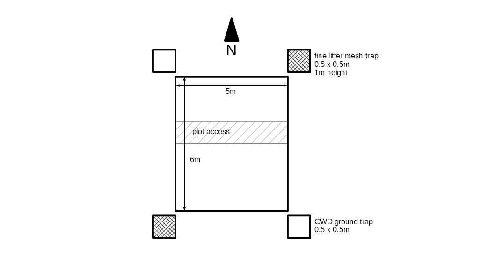

# Litter and coarse woody debris (CWD)

## Introduction 

This section of the repository contains data on fine litter and coarse woody debris (CWD) collected on 18 plots as part of the ATTA project between November 2014 and September 2017. Data were compiled in a single spreadsheet available as *.xlsx and *.csv format.

## Data Collection

The figure below gives an overview of the setup used in the field to collect fine litter and CWD data. Two 50 x 50cm fine litter traps were located just outside the northeast and southwest corner of each plot. Traps were approximately one meter above the ground. Two 50 x 50cm ground traps were located outside the plots in northwest and southeast corners.

Fine litter and CWD were collected at bi-weekly intervals for the duration of the project (three collections missing December 2016). The fine litter collected includes leaves \<50cm in length, woody material with diameter below one centimeter and fruits and flowers. The CWD fraction collected from ground traps included leaves \>50cm in length and woody debris with a diameter between 1 and 10cm. All plant materials that were only partly inside the fine litter or ground traps were trimmed along the edge of the trap and only the section inside the trap was collected. Fine litter and CWD from both traps in each plot were pooled to obtain a plot level average. Following collection, samples were oven-dried 70degC for 72h and weighed to the nearest 0.1g. For CWD samples the leaf and woody fractions were split after drying and weighted seperately.

In case traps could not be collected (e.g. trap damaged or obstructed by large leaf) this was noted in the field notes and added as a comment in the dataset. 

## Dataset Overview

The dataset was compiled into a single spreadsheet. Each collection round corresponds to 18 lines of data (3 sites with 6 plos each). Below a view of the header and first few lines of the dataset.

The first three columns give the plot and site identifier and whether the plot is located on an Atta cephalotes nest or is a control plot. Note that columns 2 and 3 are redundant in the sense that the same info is already encoded in the PlotID, but they come in handy as grouping factors when analyzing data. 

Column four contains the date samples were collected. Typically all samples wre collected the same day, but on occasion samples from different sites were collected on two consecutive days. The fifth column gives the number of days since the last sample collection (typically around 15 days) and can be used to express results on a per day basis.

Columns six to 8 give the dry weights of the fine litter and CWD leaf and wood fractions in grams. The Sample ID column has the labels assigned to stored physical samples, while the last column contains any comment relevant to the respective sample.
&nbsp;

| Plot | Site | Nest | Date sampled | CollectDays | Fine Litter | CWD Leaf | CWD Wood | Sample IDs | Comments | 
|:----:|:----:|:----:|:------------:|:-----------:|:-----------:|:--------:|:--------:|:----------:|:--------:|
|      |      |      | (yyyy-mm-dd)	|     (-)     |     (gDW)   |   (gDW)  |   (gDW)  |    (-)     |    (-)   |
| ALPN1 | ALP | N | 2014-11-16 | 15 | 30.5 | 0.0 | 0.0 | ATTA_LIT_2014_11_16_ALPN1 | | 
| ALPC1 | ALP |	C | 2014-11-16 | 15 | 13.3 | 0.0 | 1.8 | ATTA_LIT_2014_11_16_ALPC1 | |
| ALPN2 | ALP | N | 2014-11-16 | 15 | 24.7 | 0.0 | 0.0 | ATTA_LIT_2014_11_16_ALPN2 | |
| ... |

## Credits

When using this data please reference as follows:

