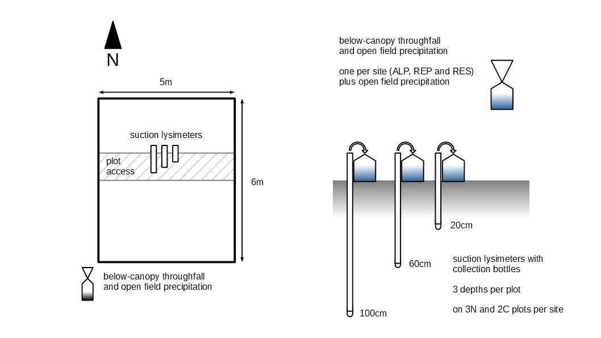

# Soil solution pH

## Intro
This section of the repository contains data on the pH of soil water collected using suction lysimeters. Water samples were collected from 3 depths (20, 60 and 100cm) on 15 plots as part of the ATTA project between October 2014 and September 2017 at monthly intervals and pH was measured. No suctions lysimeters were installed in the third replicate control plot at each site (ALPC3, REPC3 and RESC3). Starting May 2016 an additional precipitation sample and below-canopy throughfall samples (one per site) were collected. Data were compiled in a single spreadsheet available as *.xlsx and *.csv format. Missing sampes are mostly due to soil drying and cavitation of the lysimeters or in the case of below-canopy throughfall and precipitation a lack of precipitation during the sampling period. Note that data obtained during the first months following lysimeter installation may be questionable.

## Data collection

The figure below gives an overview of the setup used in the field to collect soil water samples. Central in the plots three lysimeters were installed at depths of 20, 60 and 100cm, each with a 500ml collection bottle attached. Collection bottles were housed in a capped piece of PVC pipe to avoid light affecting samples. At each site a single below-canopy throughfall sample was collected in a foil covered 250ml bottle with 10cm funnel located adjacent to the centrally located plot. In the same way a single precipitation sample was collected in a nearby open area \<2 km away from the study sites. 

Soil water samples were collected at monthly intervals for the duration of the project. At the start of each sampling campaign all lysimeters and attached lysimeters were placed under partial vacuum. The suction applied was 50kPa, 55kPa and 60kPa for samplers at 20, 60 and 100cm depth respectively. This approximately compensates for the height difference between sampling depth and collection bottle and maintains a fixed 45 to 50kPa vacuum at the sample point (at least initially). After a couple of days all water was removed from the samplers and collection bottles in order to rinse the setup and the vacuum was applied again to start the actual sampling. Lysimeters were left to sample for up to four days (typically 2 or 3) and samples were collected in polypropylene bottles. Under dry conditions a second sampling was performed to collect sufficient sample volume for pH measurement and sample analysis (see soil water chemistry). Samples were stored refrigerated until pH measurements were made, typically <24h after the last sample collection. If applicable, equal parts of two collection batches were pooled and the pH was measured on a pH211 Hanna Instruments meter. The pH meter was calibrated using 4.01 and 7.00 standards for each set of samples measured.

## Overview dataset

The dataset was compiled into a single spreadsheet. Each collection round corresponds to 49 lines of data. This follows from the fact we had 3 sites with 5 plots each (the third control replicate was not sampled) and 3 sampling depths plus a below-canopy throughfall sample at each site and a precipitation sample. Below a view of the header and first few lines of the dataset. Column headers are pretty self-explanatory.
&nbsp;

| Plot | Site | Nest | Depth | TagNr | Date sampled | pH | Comments | 
|:----:|:----:|:----:|:-----:|:-----:|:------------:|:--:|:--------:|
|      |      |      |  (cm) |  (-)  | (yyyy-mm-dd) |(-) | (-) |
| ALPN1 | ALP | N | 20 | 204 | 2014-10-17 | 5.69 | | 
| ALPN1 | ALP |	N | 60 | 205 | 2014-10-17 | 5.59 | |
| ALPN1 | ALP | N | 100 | 206 | 2014-10-17 | 5.21 | |
| ... |

The first three columns give the plot and site identifier and whether the plot is located on an Atta cephalotes nest or is a control plot. Note that columns 2 and 3 are redundant in the sense that the same info is already encoded in the PlotID, but they come in handy as grouping factors when analyzing data. Note that below-canopy and precipitation samples were given a dedicated Plot and Site ID. The forth column gives the sampling depth and is set to zero for below-canopy and precipitation samples. Column five contains a non-consecutive tag number used for reference in the field, but should not be needed in any analysis as it is redundant with columns one to four. Column six contains the date samples were collected. Typically all samples were collected the same day, but on occasion samples from different sites were collected on seperate days. Column seven gives the measured pH value for the sample while the last column contains any remarks that apply to that given sample.

## Credits

When citing this dataset please reference as follows:

Tamara Jane Zelikova, Thomas Harmon, Michael F. Allen, Steven F. Oberbauer, Diego Dierick, Luitgard Schwendenmann, Adrian A. Pinto-Tomas, Philip W. Rundel, Catalina Murillo, Amanda Swanson, Nicole Trahan, Michael Meredyth-Young, Angel S. Fernandez-Bou, Jules Cooch, Suzanne Henderson, Anna DiPaola, William Kinn, Deo Lachman, Utsarga Bhattarai, Odemaris Carrasquillo Quintana, Shaquetta Johnson, Ana Grace Alvarado, and Yorelyz Rodriguez-Reyes. 2019. ATTA Biogeochemistry Data Collection. Zenodo. http://doi.org/10.5281/zenodo.3268830.

